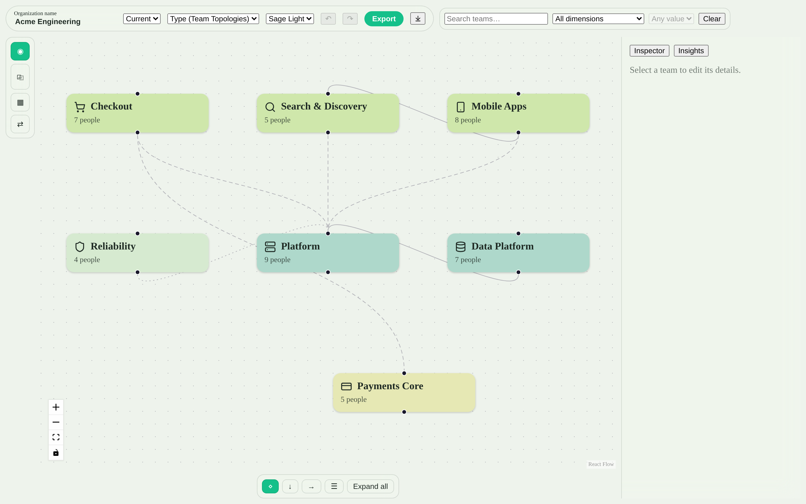

# Canopée

Canopée is a client-side web app to **visualize and design an organization's
topology** — teams, their types, scope and missions, and the relationships
between them. It serves two purposes:

- **Document** the current organization as a living, readable reference.
- **Design** reorganizations in a sandbox and compare scenarios side by side
  before committing to them.

The model is deliberately generic: no framework is hard-coded. Common ones
(Team Topologies, by-craft, by-stream, Spotify…) ship as editable taxonomy
templates and live entirely inside your file once applied.



## Features

### Modeling

- **Generic taxonomy.** Tag teams along multiple dimensions (topology, domain,
  maturity…). Any value or relationship type that isn't in the taxonomy is
  shown as "uncategorized" rather than rejected, so imports never break.
- **Teams & people.** Mission, scope, icon, per-role headcount, and optional
  members; a person can belong to several teams.
- **Typed relationships.** Directed or undirected links with taxonomy-driven
  styles (collaboration, x-as-a-service, facilitating…).
- **Framework templates.** Start from Team Topologies, by-craft, by-stream,
  Spotify or a blank model; once applied the taxonomy lives in your file and is
  fully editable.

### Visualization

- **Interactive graph.** A full-screen React Flow canvas; click a node to
  inspect and edit it in place.
- **Automatic layouts.** Free (manual positions), top-bottom, left-right, and
  swimlanes grouped by a dimension — powered by elk.
- **Filtering.** Scope the canvas by text or by a dimension value; the same
  scope drives the insights.
- **Compact / expanded cards** with an "expand all" toggle; node color is
  driven by the dimension you choose.

### Scenarios & comparison

- **Scenarios** branch off the current state and store only their deltas, so
  the file stays compact and every variant derives directly from the baseline.
- **Side-by-side comparison** of two scenarios with a four-state diff
  (added / removed / modified / relationship) and an exportable summary.

### Insights

Pure org-design indicators, recomputed on the filtered scope: team size
(mean / median / out-of-range), intra-team communication load, inter-team
coupling and isolated teams, dependency depth, distribution charts, a
Team-Topologies stream-aligned ratio, a cognitive-load proxy, and actionable
design alerts — rendered with hand-crafted SVG mini-charts.

### Persistence & export

- **One portable file.** The source of truth is a single Zod-validated
  `.orga.json` you export and version in Git. Work in progress is autosaved to
  `localStorage` and restored on reload.
- **Render export.** Export the graph or a team directory as **SVG or PNG**,
  with a themed or transparent background, from a dialog with a live preview.

## Examples

Sample organizations live in [`examples/`](examples/):

- `acme-engineering.orga.json` — a realistic Team-Topologies org (the one
  pictured above).
- `starter-team-topologies.orga.json` — a minimal starting point.

Load one from the welcome screen via **Import**.

## Getting started

Requirements: Node ≥ 26 and pnpm ≥ 11.

```bash
pnpm install
pnpm dev          # start the dev server
```

Open the app, create a new organization (or import an example from
`examples/`), and start mapping teams.

For build, test and project-structure details, see
[CONTRIBUTING.md](CONTRIBUTING.md).

## Tech stack

Vite · React · TypeScript (strict) · Zustand · Zod · React Flow · elkjs ·
Lucide · Vitest + Testing Library · Playwright. Charts are hand-crafted SVG —
no charting dependency.

## License

Apache License 2.0 — see [LICENSE](LICENSE). Copyright 2026 Canopée.
